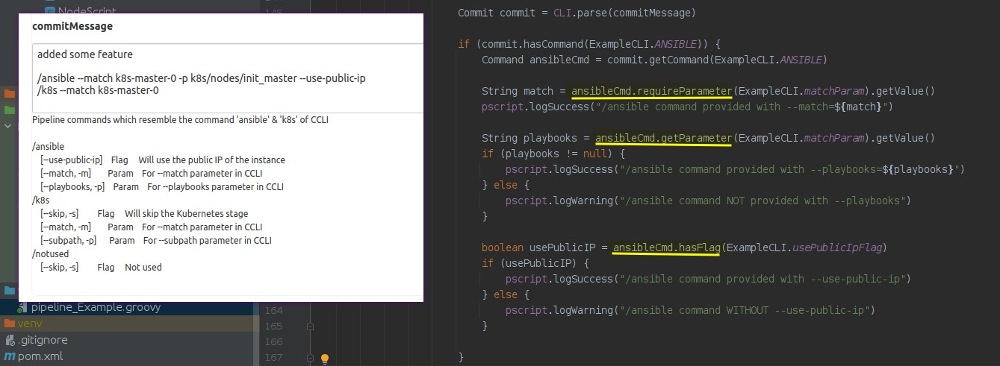

{:toc}

# Basics


## How to start?

- Check the Example job `vars/pipeline_ccli.groovy`. It contains the majority of functionality.


## Why PScript?

- It's just a wrapper around `Script` which ensures that you have less struggle with CPS exceptions.

- Whenever you need some pipeline method like `sh` then better a `PScript` instance. If something is missing then create a wrapper method in there.

- Simply create it at the begin of your pipeline

  ```java
  @Field PScript pscript = new PScript(this)
  ```

- All plugins which you use should also be available, e.g. `buildName`

  ```java
  pscript.setNameOfBuild("Example #${env.BUILD_ID}")
  
  void setNameOfBuild(String nameOfBuild) {
      this.script.buildName(nameOfBuild)
  }
  ```

- Note that `PScript` only works in `script {}` blocks, i.e. they are always executed on the master

- There are lots of helpers, e.g.
  - `shGetOutput()`
  - `getEnvWorkspace()`
  - `logSuccess()`
  - `logWarning()`
  - `exitWithError()`
  - `setNameOfBuild()`
  - `execute()`
  - `currentStage()`
  - `markStageAsUnstable()`
  - `getUserColonPassword()`
  - etc.


# Pipelines


## Handling job parameters

- Use the helper `Param`

  ```java
  @Field Param param = new Param(pscript)
      
  // ...
      
  name = param.asString(params.name, "name")	// "name" is the parameter name used in the job summary
          .isNotEmpty()
          .isOneOf(ExampleList.names)
          .get()
      
  age = param.asInteger(params.age, "age")
          .isGreaterThan(10)
          .get()
      
  option = (ExampleChoice) param.asEnum(params.option, ExampleChoice.class, "option")
          .get()
      
  areYouSure = param.asBoolean(params.areYouSure, "areYouSure")
          .mustBeTrue()
          .get()
  ```

  

## Fancy job summary reports

- Easier than reading console output

  

- There are various helper methods

  ```
  pscript.logSuccess("Post action 'always' was successful")
  pscript.logWarning("Post action 'failure': Triggered because the job failed.")
  
  pscript.exitWithError("<b>Stage: '${pscript.getStageName()}':<b> Just some error to show some error.")
  ```


## Making assertions

- There's a limited amount of assertion helpers. They're mostly used in `Param` and make not much sense on their own. So just use `Param` instead.

- Examples:

  ```java
  assertThat.isNotEmpty(name, "'name' must not be null")
  assertThat.isNotNull(option, "'option' must not be null")
  ```


## Delaying starts, skipping stages or stopping early

-  `StageFlow` gives you more control about complex pipelines. This is especially useful if stages are expensive to run.

- You need to define your stages as Enum and initialize `StageFlow` with them. The starting stage and ending stage need to be configured as parameters:

  ```java
  choiceParam("startFrom", JobDslUtil.toChoiceList(ExampleStage.values()),
                  "Stage to start from. List is ordered.")
  choiceParam("stopAfter", StageFlow.getStopAfterStagesForJobDsl(ExampleStage.values()),
                  "Stage to stop after, rest will be skipped.")
  ```

- Which then look like this:

  

- 

- All stages before the `startFrom` Enum will be skipped, then the pipeline continues running until `stopAfter` is reached.

- Example:

  ```java
  # Create `StageFlow` with enum `ExampleStage`
  @Field StageFlow<ExampleStage> flow = new StageFlow<>(pscript)
  
  // ...
  
  // Init StageFlow
  startFrom = (ExampleStage) param.asEnum(params.startFrom, ExampleStage.class, "startFrom")
                                  .get()
  stopAfter = (ExampleStage) param.asEnum(params.stopAfter, ExampleStage.class, "stopAfter")
                                  .get()
  flow.fromTo(startFrom, stopAfter);
  
  // ...
  
  // Use together with `when`
  stage('Clone Git repo') {
      when {
          allOf() {
              expression { flow.shouldProcess(ExampleStage.cloneGitRepo) }
          }
      }
  ```


## Make Git repos into reusable objects

- There's a generic class to clone, pull & push repos

  ```java
  String userColonPassword = userColonPassword = pscript.getUserColonPassword("uc_repo_user")
  GitRepo gitRepo = new GitRepo(pscript,
          pscript.envWorkspace,                   // parent directory where to clone the repo into
          "https://github.com/53rg3/jekylldocs",  // URL of the repo
          userColonPassword)                      // user:password
  gitRepo.cloneRepo()
  
  sh "ls -la ${gitRepo.repositoryPath}"
  ```

- You can extend it and create your own classes with helper methods however you like. This is especially useful for repos with many scripts.

  ```java
  class CcliRepo extends GitRepo {
  
      private static final String remoteRepositoryUrl = "https://github.com/surg3/ccli.git"
  
      CcliRepo(PScript pscript, String userColonToken) {
          super(pscript,
                  "${Constants.REPO_DIR}",
                  remoteRepositoryUrl,
                  userColonToken)
      }
  
      void cloneAndInstall() {
          this.pullOrClone()
          this.pscript.sh("cd ${this.repositoryPath} && pip3 install .")
      }
  
      void execute(CcliCommand ccliCommand) {
          this.pscript.sh("cd ${this.repositoryPath} && ${ccliCommand.get()}")
      }
  ```

  

## Run arbitrary scripts (Python, Ruby, JARs, etc)

- `NodeScript` let's you run any scripts which you can conveniently load from the shared library. 

- Just store whatever script you need in `resources/nodescript`. These can be programs of any complexity. 

- This also works on external Jenkins worker nodes, if you execute the scripts outside the `script {}` block.

- You can also add additional files (e.g. secrets) on the fly.

- `NodeScript` uses Jenkins' `stash` functionality to move the `resources/nodescript` directory to the worker node (can be the  master) 

- Example:

  ```java
  stage('NodeScript') {
      when {
          allOf() {
              expression { flow.shouldProcess(ExampleStage.nodeScript) }
          }
      }
      steps {
          // Prepare your NodeScript on the master and stash it
          script {
              sh "echo 'INIT NODESCRIPT:'"
              NodeScript nodeScript = new NodeScript(pscript, pscript.getPathToSharedLibrary())
              sh "echo 'ADD FILE:'"
              String content = """
                  asdf
                  yxcv
                  qwer
              """.stripIndent().trim()
              nodeScript.addFile("ccli/secrets.json", JsonOutput.toJson([
                      "user"       : "bob",
                      "token"      : "super_secret",
                      "secret_file": content
              ]))
              sh "echo 'STASH:'"
              nodeScript.stash(NodeScript.NODE_SCRIPT_DIR)
          }
          // Unstash and execute on the worker node (might be the master)
          unstash NodeScript.NODE_SCRIPT_DIR
          sh "${env.ECHO_SCRIPT}"
      }
  }
  ```

- Note that you can't use variables from `script {}` block outside of them, but you can store them in `env`. E.g.

  ```java
  environment {
      ECHO_SCRIPT = "python3 ${NodeScript.NODE_SCRIPT_DIR}/ccli/echo.py"
  }
  ```

  

## Execute terminal commands

- Instead of `sh` you can use `pscript.execute()` which automatically adds fancy log messages to the job summary, depending on the result of the command.

- Just define the command and success + failure messages

  ```java
  cmd = "ls -la ${pscript.getPathToSharedLibrary()}"
  pscript.execute(cmd,
          "Successfully executed command:<br>\n${cmd}",
          "Failed to execute command:<br>\n${cmd}")
  ```

  

## Make HTTP requests

- There's a rudimentary HTTP client. Don't expect anything fancy, because CPS exception.

- By default it also accepts self-signed certs

- Easy peasy as this:

  ```java
  HttpResponse httpResponse = HttpClient.get(pscript, "https://example.com")
  pscript.print(httpResponse.toString())
  ```

- If you need a special client for some API, then copy the whole class and create your own. Don't try OOP... I tried... but CPS exceptions beat me into submission...


## Control pipelines via Git commit messages (CommitCLI)

- There's a rudimentary CLI util which can parse strings (e.g. commit messages in Git) for commands.

- This works best with webhooks. I.e. your Generic Webhook plugin makes the commit messages available to your pipeline and CommitCLI parses the messages for commands. 

- Lines starting with `/` are interpreted as commands and the rest is ignored.

- You define your parameters & flags of your CLI in some external class in a `static` fashion for Job DSL:

  ```java
  class ExampleCLI {
  
      public static final String ANSIBLE = "ansible"
      public static final String K8S = "k8s"
      public static final String NOT_USED = "notused"
      public static final List<String> matchParam = List.of("--match", "-m")
      public static final List<String> subPathParam = List.of("--subpath", "-p")
      public static final List<String> playbooksParam = List.of("--playbooks", "-p")
      public static final List<String> usePublicIpFlag = List.of("--use-public-ip")
      public static final List<String> skipFlag = List.of("--skip", "-s")
  
      static CommitCLI create(PScript pscript) {
          return new CommitCLI(pscript)
                  .help("Pipeline commands which resemble the command 'ansible' & 'k8s' of CCLI")
                  .addCommand(new Command(ANSIBLE)
                          .addFlag(usePublicIpFlag, "Will use the public IP of the instance")
                          .addParam(matchParam, "For --match parameter in CCLI")
                          .addParam(playbooksParam, "For --playbooks parameter in CCLI")
                  )
                  .addCommand(new Command(K8S)
                          .addFlag(skipFlag, "Will skip the Kubernetes stage")
                          .addParam(matchParam, "For --match parameter in CCLI")
                          .addParam(subPathParam, "For --subpath parameter in CCLI")
                  )
                  .addCommand(new Command(NOT_USED)
                          .addFlag(skipFlag, "Not used")
                  )
      }
  
      static String getHelpText() {
          return create(null).toString()
      }
  ```

- And then you just parse the commit message and act accordingly however you like:

  


# Job DSL


## ChoiceParam - Enum to list

You cannot simply drop `Enum.values()` into the `choiceParam`.

- Either convert directly

  ```
  choiceParam('Options', List.of(ChoiceExample.values()), 'String parameter')
  ```

- Or use the helper

  ```java
  choiceParam('Options', JobDslUtil.toChoiceList(ChoiceExample.values()), 'String parameter')
  ```


## Get last stage as default for StageFlow

- Use `StageFlow.getStopAfterStagesForJobDsl(YOUR_STAGES_ENUM.values())` 

  ```java
  choiceParam("startFrom", JobDslUtil.toChoiceList(ExampleStage.values()),
          "Stage to start from. List is ordered.")
  choiceParam("stopAfter", StageFlow.getStopAfterStagesForJobDsl(ExampleStage.values()),
          "Stage to stop after, rest will be skipped.")
  ```

  
