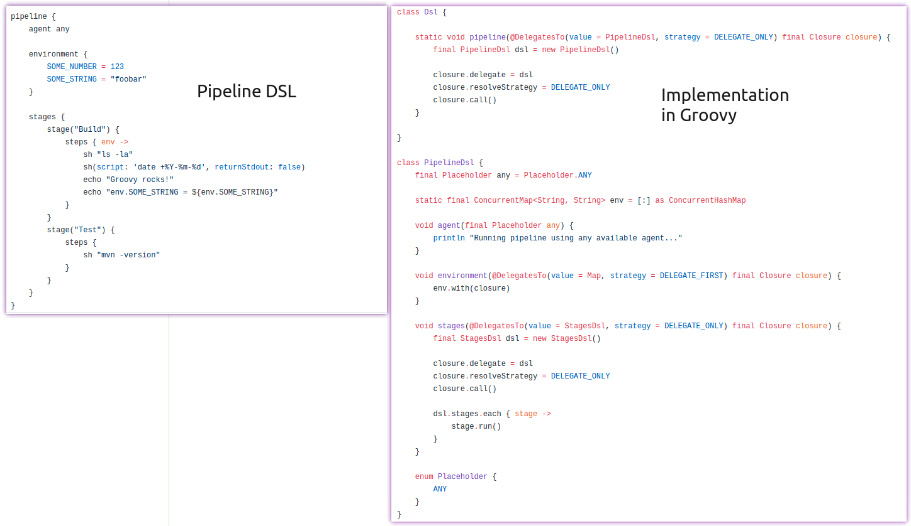

{:toc}

# Resources

## Shared libraries

- [Official docs for shared libraries](https://www.jenkins.io/doc/book/pipeline/shared-libraries/)
- [CPS mismatch exceptions](https://www.jenkins.io/doc/book/pipeline/cps-method-mismatches/) (you will run into these often)
- [SAP’s shared library](https://github.com/SAP/jenkins-library) (shows some advanced usages)

## Job DSL

- [Job DSL plugin homepage](https://plugins.jenkins.io/job-dsl/)
- [Job DSL API reference](https://jenkinsci.github.io/job-dsl-plugin/)
- [Job DSL examples](https://github.com/sheehan/job-dsl-gradle-example)
- [Advanced example for setting up jobs via a factory](https://www.jvt.me/posts/2021/02/23/getting-started-jobdsl-standardised/) (if you need a lot of jobs...)

## Pipeline DSL

- [Pipeline section in the docs](https://www.jenkins.io/doc/book/pipeline/)
- [Pipeline examples](https://www.jenkins.io/doc/pipeline/examples/)
- [Pipeline Best Practices](https://www.jenkins.io/doc/book/pipeline/pipeline-best-practices/)
- [Pipeline Syntax](https://www.jenkins.io/doc/book/pipeline/syntax/) (API reference)
- [Pipeline Development Tools](https://www.jenkins.io/doc/book/pipeline/development/)
- [Pipeline Basic Steps](https://www.jenkins.io/doc/pipeline/steps/workflow-basic-steps/)
- [Generic Webhook Trigger plugin](https://bjurr.com/jenkins-integration-on-steroids/)

# Basics

## Understanding Groovy DSL

Groovy DSL is what you see in `JenkinsFiles`. Both Pipeline DSL and Job DSL are based on Groovy DSL. All those code blocks you see like `pipeline { ... }`, `stages { ... }`, `steps { ... }`, etc are basically just some implementation of classes and methods in Groovy. So you can imagine them as helper methods which abstract complexity from you. To get a better feeling for how things work in detail, watch this [video](https://www.youtube.com/watch?v=i9pNYW1Pg9A).

The only thing you actually need to understand is that you need to stay in the bounds of the given DSL. Pipeline DSL doesn’t know about the methods of Job DSL and vice versa.

Here’s an example how the implementation of Groovy DSL could look like ([source code](https://github.com/wololock/groovy-dsl-quickstart)):

